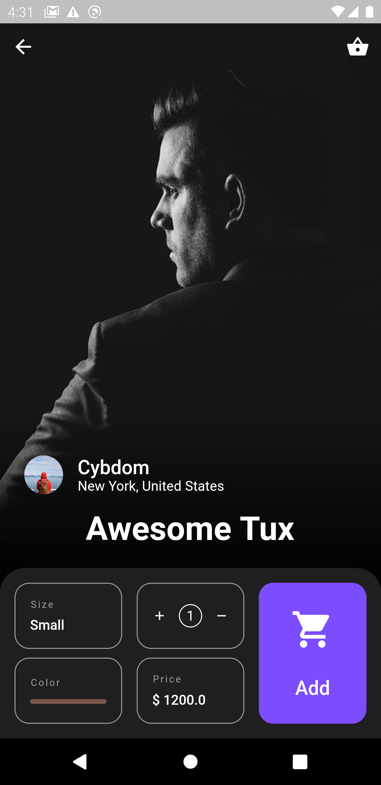
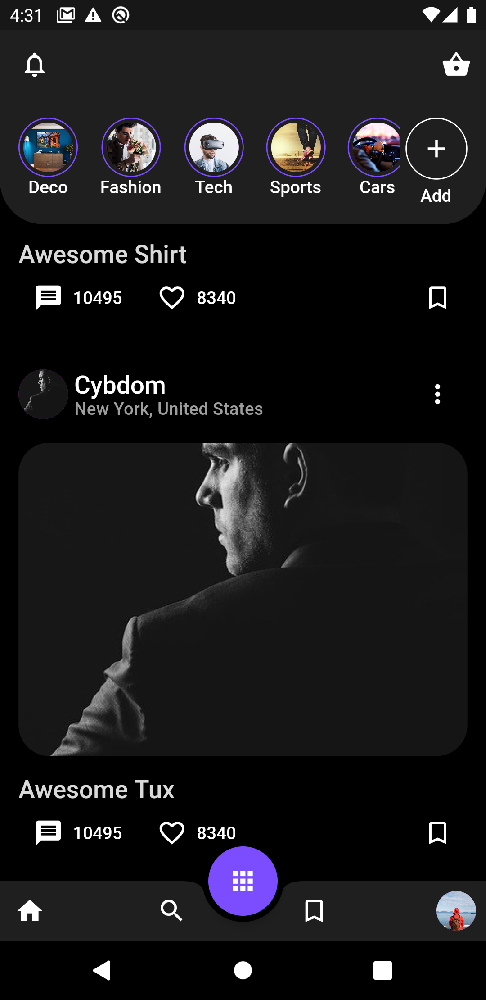

# cloth_store

Donation Links: <a href="https://www.buymeacoffee.com/bi3cp0Zk5">Buy Me A Coffee!</a>

Bitcoin Address: bc1q7hvpgfw29ckxdhckvd5j3fcedgqx40vk687a0h

Tutorial: <a href="https://cybdom.tech">Flutter Tutorials by Cybdom</a>

Result:

Original Design:

## Getting Started

This project is a starting point for a Flutter application.

A few resources to get you started if this is your first Flutter project:

- [Lab: Write your first Flutter app](https://flutter.dev/docs/get-started/codelab)
- [Cookbook: Useful Flutter samples](https://flutter.dev/docs/cookbook)

For help getting started with Flutter, view our
[online documentation](https://flutter.dev/docs), which offers tutorials,
samples, guidance on mobile development, and a full API reference.
